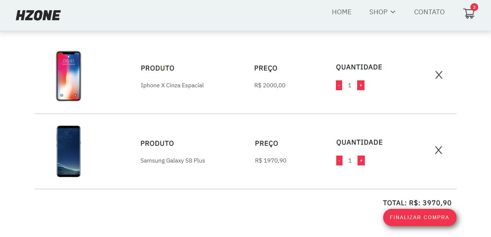

## Hzone

Um e-commerce de smartphones com autenticação de usuário, inputs de pesquisa e shopping cart. O projeto foi feito com ReactJS, Redux, Redux-Saga, ContextAPI, SCSS e Firebase.

## Screenshots

## Firebase

Utilizei o firebase para guardar os dados dos produtos usados no site e fazer a autenticação de login e cadastro de usuários.

`Produtos` 

`Autenticação` 

## Instalação e configuração.

Faça um clone desse repositório. Tenha instalado `npm` e `node` na sua máquina.

Instalação:

`npm install`  

Para iniciar o servidor:

`npm start`  

## Reflexão

Esse foi um projeto feio em 2 semanas. O objetivo desse projeto foi utilizar algumas tecnologias que eu já conheço, mas principalmente aprender sobre o ReactJS e me familiarizar com a library.

Eu queria criar um e-commerce com shopping cart que permitisse que os usuários pesquisem produtos do site ou utilizem filtros como `Maior preço` para encontra-los. Eu iniciei esse projeto utilizando `create-react-app` e depois adicionando o `react-router`.

Um dos desafios principais foi como compartilhar os dados da aplicação nos componentes de uma forma mais fácil. Acabei perdendo alguns dias pesquisando sobre Redux e Context API, como esse foi o meu primeiro projeto em React, sua fácil implementação e o gerenciamento de dados do site não ser tão grande, acabei utilizando o Context API. 

Todas as tecnologias que eu utilizei nesse projeto são React, Context API, SCSS, Formik, Yup, React-Router, GSAP, React-icons, React-Modal e StripeJS. No meu próximo projeto pretendo trabalhar com um maior volume de dados utilizando o Redux para entender melhor o poder da ferramenta. 

