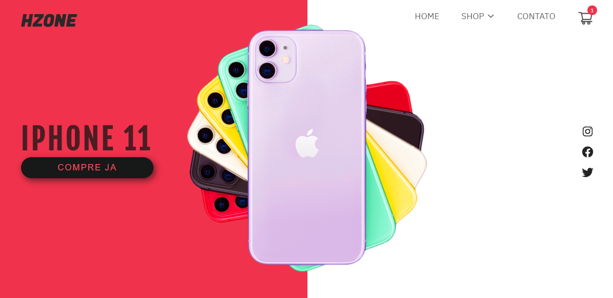
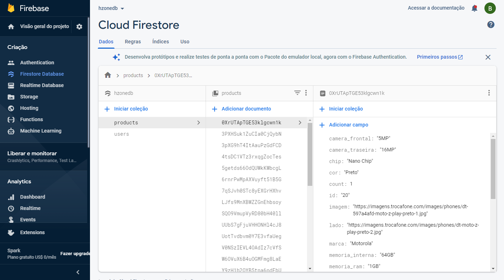
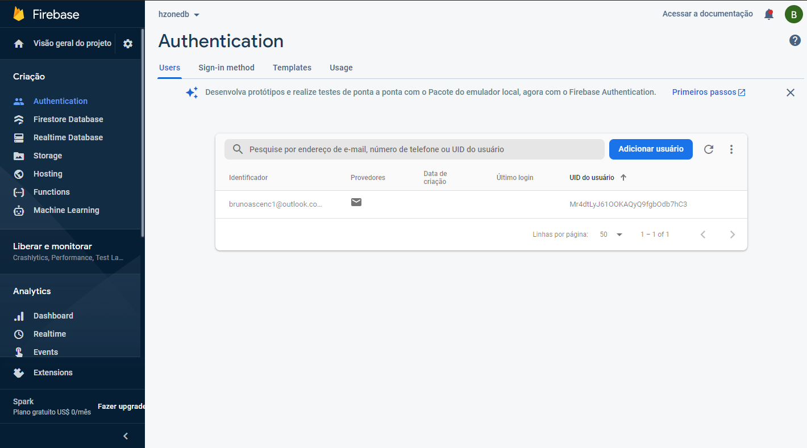
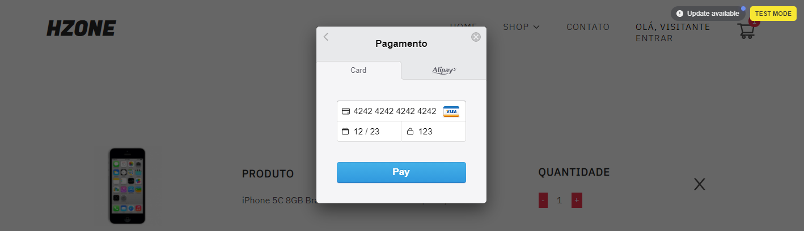

# Hzone

Um e-commerce de smartphones com autenticação de usuário, inputs de pesquisa e shopping cart. O projeto foi feito com ReactJS, Redux, Redux-Saga, ContextAPI, SCSS, Firebase e Stripe.

[HZONE](https://hzonecommerce.netlify.app/)

## Instalação e configuração.

Faça um clone desse repositório. Tenha instalado `npm` e `node` na sua máquina.

Instalação:

`npm install`  

Para iniciar o servidor:

`npm start`  

## Screenshots

## Firebase

Utilizei o firebase para guardar os dados dos produtos usados no site e fazer a autenticação de login e cadastro de usuários.

##### Produtos

##### Autenticação

## Stripe

Utilizei o stripe para o checkout dos itens do carrinho.

*Para testes use os dados abaixo*

## Tecnologias usadas

* [ReactJS](https://pt-br.reactjs.org/)

* [Firebase](https://firebase.google.com/?gclid=CjwKCAjwwqaGBhBKEiwAMk-FtK2md4eBZaKVK-0wA0SZGCtR9JHtglOYCfMurF59mAzYr4n5Q9ML2xoCLhIQAvD_BwE&gclsrc=aw.ds)

* [SCSS](https://sass-lang.com/)

* [SwiperJS](https://swiperjs.com/react)

* [Stripe](https://stripe.com/br)

## Objetivo

Esse foi o meu primeiro projeto feito em ReactJS e resolvi atualiza-lo aplicando os meus conhecimentos obtidos de um curso sobre ReactJS, Redux, Redux-Saga e Firebase. Então resolvi modificar esse projeto que estava em ContextAPI para redux e redux-saga com a alocação dos dados no firebase. Também foi implementado um sistema de login/cadastro com autenticação pelo firebase e uma melhor organização dos componentes/pastas.
